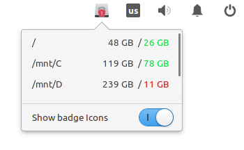

#  Wingpanel Disk-Usage Indicator
<h4 align="center">
          
</h4>

<h1 align="center">
    
</h1>

## Building and Installation

You'll need the following dependencies:

 - `libgdk-pixbuf2.0-dev`
 - `libglib2.0-dev`
 - `libgranite-dev`
 - `libgtk-3-dev`
 - `libwingpanel-2.0-dev`
 - `meson`
 - `valac`

Run `meson` to configure the build environment and then ninja to build:

```
meson build --prefix=/usr
cd build
ninja
```

To install, use ninja install:

`sudo ninja install`

## Installation
### Void [WIP]

## License

